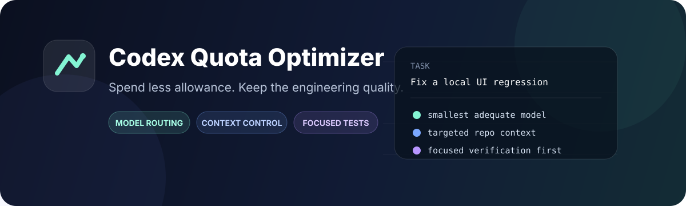
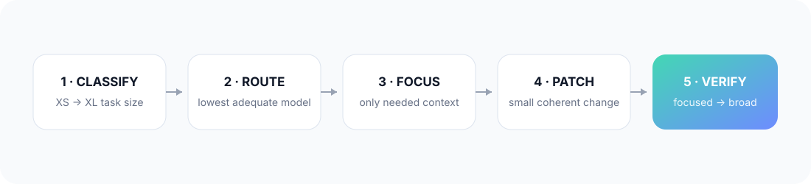

<p align="center">
  
</p>

<p align="center">
  <strong>简体中文</strong> · <a href="./README.md"><strong>English</strong></a>
</p>

<p align="center">
  <a href="./LICENSE"></a>
  \n  
  
  
</p>

# 少花 Codex 额度，不牺牲工程质量

**Codex Quota Optimizer** 是一个开源 Codex Skill + Plugin，目标是在保证任务正确完成的前提下，减少 Plus / Pro 用户不必要的额度消耗。Skill 直接安装和 Plugin 分发共用同一份核心 Skill 源码。

Codex 的额度并不只花在“写代码”上。很多消耗其实来自：**重复理解仓库、简单任务使用过强模型、推理档位过高、过早运行全量测试、不必要地启用 Subagent，以及超出需求范围的顺手重构。**

这个 Skill 给 Codex 加上一条核心执行原则：

> **先走成本最低、但足够可靠的执行路径；只有证据表明不够时，才升级。**

它**不会**绕过平台限制、抓取你的私有额度页面，也不会为了“看起来省”而牺牲必要验证。

---

## 30 秒看懂它改变了什么

| 常见额度浪费 | 使用 Codex Quota Optimizer 后 |
|---|---|
| 不管任务大小都用强模型 | 先判断 XS → XL，再选择最低够用的模型 |
| “以防万一”先读大量代码 | 先搜索，只读取修改面和直接依赖 |
| 默认高推理 | 从较低档开始，真正有歧义再增加推理 |
| 改一点就跑全量测试 | 分层验证：单文件 → 定向测试 → 模块 → 全量 |
| 有 Subagent 就开 | 只有真正适合并行拆分的大任务才使用 |
| 修一个问题顺手重构一片 | 只做满足验收条件的最小完整改动 |
| 升级模型后重新理解一遍项目 | 升级前先压缩已知结论，避免重复认知 |

<p align="center">
  
</p>

---

## 安装

### 方式 A｜全局安装 · 推荐

一次安装，在所有 Codex 项目里使用：

```bash
git clone https://github.com/ctdaniel/codex-quota-optimizer.git
cd codex-quota-optimizer
./install.sh
```

Skill 会被安装到：

```text
~/.agents/skills/codex-quota-optimizer
```

Codex 通常会自动检测新 Skill；如果没有出现，重启 Codex 即可。

### 方式 B｜项目级安装

把仓库中的核心 Skill：

```text
skills/codex-quota-optimizer/
```

复制到具体项目的：

```text
.agents/skills/codex-quota-optimizer/
```

然后和代码一起提交。如果团队所有人都希望采用同样的额度优化策略，这种方式更合适。

> Codex 官方支持 `~/.agents/skills` 的用户级 Skill，以及 `.agents/skills` 的仓库级 Skill。参考 [OpenAI Skills 官方文档](https://developers.openai.com/docs/build-skills)。

---

## 怎么用

### 1. 显式调用

在 Codex CLI / IDE 中输入 `$` 选择 Skill，或者直接写：

```text
$codex-quota-optimizer
帮我修复这个结算页 Bug，在保证可靠性的前提下尽量节省 Codex 额度。
```

### 2. 直接自然语言表达

这个 Skill 默认允许隐式调用，所以你也可以直接说：

```text
帮我尽量节省 Codex 额度完成这个功能。
```

```text
我的 Plus 额度不多了，用最低可靠消耗把这个任务做完。
```

```text
先用最低够用模型和定向测试，只有解决不了时再升级。
```

### 3. Emergency Mode｜额度告急模式

当你告诉 Codex“额度快没了”时，Skill 会自动采用更严格的策略：

- 不做非必要重构；
- 不大范围探索仓库；
- 不随意启用 Subagent；
- 尽量只走一条实现路线；
- 使用最低够用模型；
- 优先做定向验证。

但**正确性和明确的验收要求仍然优先**。

---

## 它具体优化什么

<table>
<tr>
<td width="50%" valign="top">

### 🧠 模型与推理路由

先将任务判断为 **XS → XL**，从能够可靠完成任务的最低模型 / 推理档开始。

只有出现真实的架构歧义、跨模块复杂度、高风险或困难 Debug 时才升级。

</td>
<td width="50%" valign="top">

### 🔎 上下文控制

优先看目标任务、当前 Diff、项目规则和定向搜索，再决定需要打开哪些文件。

核心目标是避免 Codex 一遍又一遍“重新认识项目”。

</td>
</tr>
<tr>
<td width="50%" valign="top">

### ✂️ 最小改动面

围绕验收标准完成最小但完整的 Patch，不顺手升级依赖、不格式化无关代码、不扩大重构范围。

</td>
<td width="50%" valign="top">

### ✅ 分层验证

从最小相关检查开始；只有修改范围和风险真的需要时，才扩大到模块测试或全量测试。

</td>
</tr>
<tr>
<td width="50%" valign="top">

### 🧩 Subagent 克制

多 Agent 会放大上下文和工作量。只有大型任务确实可以拆成多个相对独立工作流时，才值得并行。

</td>
<td width="50%" valign="top">

### 🧾 长任务状态压缩

长任务只保留精简 Checkpoint：目标、决策、已改文件、测试结果、下一步，减少反复解释相同上下文。

</td>
</tr>
</table>

---

## 模型路由思路

按照 OpenAI 当前的模型定位，大致可以理解为：

| 任务形态 | 优先角色 | 当前示例 | 起始推理档 |
|---|---|---|---|
| 机械、明确、重复性修改 | 最快 / 最经济 | GPT-5.6 Luna | Low |
| 日常开发任务 | 均衡型 | GPT-5.6 Terra | Low / Medium |
| 复杂、开放式任务 | 深度模型 | GPT-5.6 Sol | Medium |
| 最困难、多步骤、多工具任务 | 最强可用模型 | GPT-6 Astra | 按需 |

模型阵容和不同套餐的可用性可能变化，所以 Skill 的原则是：**优先按模型角色路由，而不是把某个模型名写死成永久规则。**

同时，它不会用固定“Plus 能发多少条、Pro 能发多少条”作为核心判断，因为真实消耗还会受任务复杂度、上下文和推理程度影响。

参考 [OpenAI Codex 模型说明](https://developers.openai.com/docs/models)。

---

## 验证阶梯

```text
Level 1     修改文件自身的检查
    ↓
Level 2     与修改行为最相关的定向测试
    ↓
Level 3     Package / 模块级 typecheck、lint、test
    ↓
Level 4     全量测试 / 发布前 Gate
```

一个局部修改，不应该自动承担 Level 4 的成本。

---

## 两个辅助脚本

Skill 不依赖它们也能工作，但在较大的项目中它们可以进一步减少探索开销。

### Compact Repository Snapshot

```bash
python skills/codex-quota-optimizer/scripts/repo_snapshot.py --compact
```

快速生成精简项目结构，并自动忽略常见的大目录，例如 `node_modules`、`dist`、`.next`、`coverage`、`.venv`。

### Change Scope Analyzer

```bash
python skills/codex-quota-optimizer/scripts/change_scope.py
```

总结当前 Git 改动范围，并给出合理的验证层级建议。

两个工具都只在本地工作，不上传项目数据。

---

## 三种工作模式

| 模式 | 更适合 | 默认策略 |
|---|---|---|
| **Economy** | Plus、长时间 Vibe Coding、剩余额度较少 | 范围更严格、经济模型优先、定向测试优先 |
| **Balanced** | Pro 或日常开发 | 均衡模型优先，复杂度足够高再使用深度模型 |
| **Emergency** | 额度即将耗尽 | 单路线、不做可选工作、最小可靠探索和验证 |

这些是**行为预算**，不是虚构的账户额度计数器。

---

## 它明确不会做什么

- ❌ 绕过或规避 OpenAI 使用限制
- ❌ 在产品没有提供数据时声称知道你的精确剩余额度
- ❌ 爬取你的私有账户或 Usage 页面
- ❌ 收集账号凭证
- ❌ 上传 Telemetry
- ❌ 为了节省额度而跳过真正必要的正确性验证

Plus / Pro 的用量规则可能更新。OpenAI 当前说明，部分受支持的 Agent 能力可能共享使用额度，因此真正需要判断剩余额度时，应以产品内的 Usage 页面为准。参考 [OpenAI Help Center](https://help.openai.com/en/articles/12642688-using-credits-for-flexible-usage-in-chatgpt-freegopluspro)。

---

## 项目结构

```text
codex-quota-optimizer/
├── plugin.json                    # 可移植 Agent Plugin manifest
├── .codex-plugin/
│   └── plugin.json                # Codex 兼容 manifest
├── skills/
│   └── codex-quota-optimizer/     # 唯一核心 Skill 源码
│       ├── SKILL.md
│       ├── agents/openai.yaml
│       ├── references/
│       └── scripts/
├── assets/                        # Plugin 图标 + README 视觉资源
├── examples/
├── install.sh                     # 安装到 ~/.agents/skills
└── README.zh-CN.md
```

---

## Roadmap

- [ ] 本地 **Usage Journal**：记录任务级使用行为，不抓取私人账户数据
- [ ] **Task Classifier**：输出任务规模、模型角色、推理档和测试建议
- [ ] **Session Budget**：给探索 / 编码 / 验证分配任务级工作预算
- [ ] **Usage Audit**：任务结束展示本次避免了哪些无效工作
- [ ] 自动识别不同框架最合适的定向测试
- [x] Plugin 打包：同时支持 Skill 直装与 Plugin 分发
- [ ] HOL Codex Plugin Catalog 收录\n- [ ] Benchmark：对比默认工作流和优化工作流

欢迎提交 Issue / PR。参见 [CONTRIBUTING.md](./CONTRIBUTING.md)。

---

## 为什么要开源？

“怎么省额度”这套策略本身就应该是透明、可检查、可修改的。

你可以直接看到 Skill 到底对 Codex 下了什么规则，也可以针对自己的团队调整，并随着 Codex 的变化共同迭代更好的启发式策略。

**没有黑盒省额度技巧，只有更克制、更高效的 Agentic Engineering。**

---

## License

MIT © 2026

如果它真的帮你节省了不少 Codex 额度，欢迎点一个 ⭐，让更多人看到。